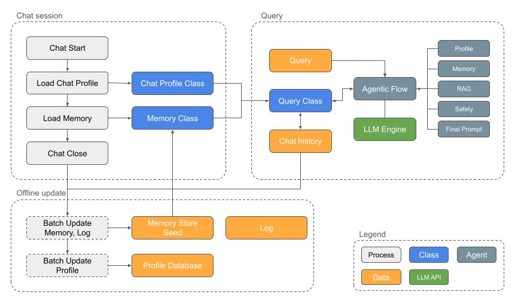
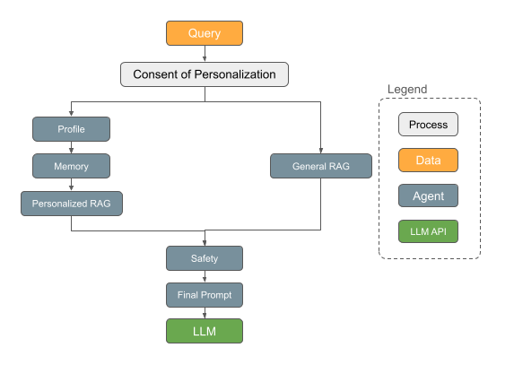
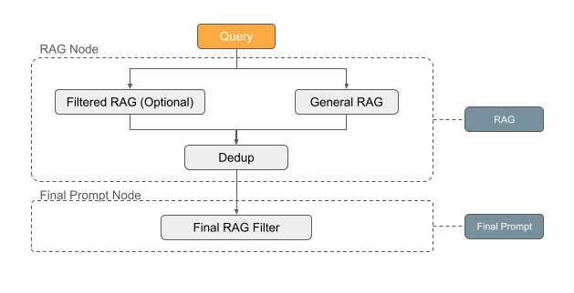
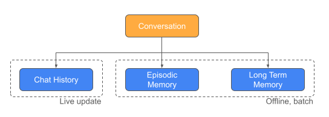
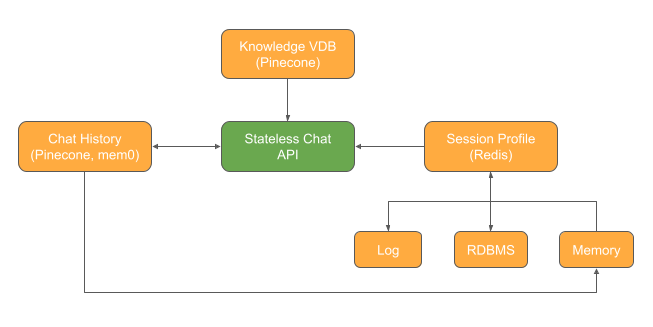

# Personalized RAG Experiment Notebook

## Overview
This notebook implements a **Personalized RAG Financial Assistant** — an agentic chatbot that retrieves relevant financial knowledge and adapts its communication style to each user's profile. The system combines Retrieval-Augmented Generation with user memory, profile-driven persona selection, and safety guardrails to deliver contextually grounded, personalized financial guidance.

---
---

## Key Deliverables:
1. **Analytic Report & Runnable Notebook**: This notebook serve as the Analytic Report of the Personalized RAG Application, as well as the runnable notebook that test through all the functions
2. **Backend App**: a well structured code base for backend of Personalized RAG Application, which host the stateless API for question & answer, see [folder](../App/backend/).

---
---

## Highlight
1. **Architecture and decomposition**: the backend app is separated to below layers, see [folder](../App/backend/):
     - `rag`(knowledge): FAISS-backed knowledge retrieval layer
     - `agents`(agents): profile, memory, retrieval, safety, and prompt agents
     - `models`(memory & context loaded here): core domain models such as Memory, ChatProfile, and Query
     - `api`(serving): FastAPI app, dependency wiring, and request/response schemas
     - `chat_history`: mem0-based chat history storage and retrieval
     - `data_loader`(memory): loaders for CSV, JSON, and JSONL seed data
     - `llm`: OpenAI client wrapper and DSPy setup
     - `orchestration`: LangGraph pipeline orchestration
2. **RAG and retrieval design**: [3-step RAG Context Generation](#personalized-rag-prag) to ensure grounded retrieval, profile-aware reranking or filtering, using smart tool to further filter for sensible context assembly:
   1. Separated `Personalized search` (optional, increase chance of personalization if consented) and `General Search` for retrieval
   2. Consolidation and deduplication
   3. Final context filter using `DSPy`
3. **Memory and personalization**: [3-layer memory&chat history management](#chat-history-and-memory-management) to ensure historical chat was feeded to context through extact and relevant text, episodic & long term memory with expiry date. Proposed memory update strategy.
4. **Engineering quality**: [2 major technical deliverables](#key-deliverables) with runnable notebook and code for API hosting. Instruction is documented in [README](../README.md)
5. **Evaluation methodology**: Proposed [systematic evaluation framework](#evaluation-plan) to evaluate the app and track application quality improvement.
6. **Privacy and governance**: [3 layers of guardrail](#privacy--safety) to ensure the safety of the app.

---
---

## Key Libraries
| Library | Usage in This Project |
| --- | --- |
| **LangChain** | Used as supporting infrastructure alongside the agent stack. In this project it mainly complements the broader LLM application ecosystem around prompt-and-retrieval workflows, even though the core orchestration is handled by LangGraph. |
| **LangGraph** | Used to orchestrate the per-query agentic workflow. It defines the execution graph for query initialization, chat history lookup, retrieval, safety checking, context filtering, prompt building, answer generation, and memory write-back. |
| **Mem0** | Used for raw conversational memory management. It stores prior user-assistant exchanges and retrieves relevant past chat snippets as additional context for future queries. |
| **DSPy** | Used to improve prompt-time reasoning and context quality. In this project it powers relevance filtering over retrieved knowledge and chat history, and supports persona-aware response construction. |

---
---

## Data Analysis & Assumption

### Data Analysis
The assignment is provided with multiple simplistic data files that is great for a POC project. Below is the data structure analysis to compare their structure and content with the likely form in reality / production. These analysis and comparison shed light on the assumptions of using these data for the POC.

* **Profile data**: [example](../Data/user_profiles.csv), contains basic profile, section (organization), preference and summary, assuming this is from 1) questionaire of first time use 2) internal database 3) offline batch summary update. In production, assuming these information will be store in database from multiple table, in this project, we will read from the source directly, and primarily use preference and interest.
* **Log**: [example](../Data/interaction_log.csv), contains event data, query, seems stored in event level. Assuming this file was generated from app logging, and in production, likely will separate the storage of event level and query level in different tables.
* **Knowledge base** [example](../Data/knowledge_corpus.jsonl), *some document text are missing while it is referenced in the log.* assuming this is simplified knowledge base with document text and metadata, in production, the real data will contain more metadata flags for filtering and richer text that requires text processing steps to optimize context search.
* **Memory**: [example](../Data/memory_store_seed.json) 2 types of summarized memory stored, assuming these memory are updated offline with text summarization processor to extract informations of preference and topics from historical communication records, episodic and long term memory should be updated separately with different expiry period.

---

### Assumptions
Below are the key assumptions of the Personalized RAG application:
* **Scope**: The code base will mainly focus on the agentic flow and backend logic of the *stateless* Personalized RAG Chat bot, the frontend, evaluation, logging and offline batch update will required further assumption of tech stack, will not be included in the code base, but high level design principals will be proposed in this report.
* **Data Usage**: To ensure adherence to the assignment requirement, this POC will use and follow the given data with minimal required changes.

---
---

## Engineering Design

### Architecture

* **Chat Session**: each chat session will initiate the `Chat Profile` with memory loaded; routine batch offline update will run after chat close.
* **Queries**: in each query, session information including preference and interest will be loaded to the Query class, together with the user query, by running the agented flow, the intermediate result and the final query will be store in the Query class before sending to the LLM for final generation
* **Offline update**: offline batch updated will keep track on profile update, memory update and logging.

---

### Agentic Flow

* **Consented Flow**: for users who agreed to use personalized chat, the query will go through: profile agent -> memory update agent -> personalized retrieval -> safety check -> final prompt optimization, then send to LLM engine for final generation.
* **Non-consent Flow**: for users who disagreed to use personalization, the query will go through: general retrieval agent -> safety check -> final prompt optimization, then send to LLM engine for final generation.

---

### Personalized RAG (PRAG)

Three-step RAG strategy to ensure personalized retrieval and ground truth / relevance:
   1. Separated `Personalized search` (optional, increase chance of personalization if consented) and `General Search` for retrieval
   2. Consolidation and deduplication
   3. Final context filter using `DSPy`

---

### Chat History and Memory Management

Three-layer memory management:
1. Exact chat history text with `mem0` and `RAG`, treating each Q&A as a pair.
2. Episodic memory, *offline updated,* can be summarize from consolidated chat history text in 1, the focus of summarization will be the preference, interest and topic, shorter expiry period.
3. Long term memory, *offline updated,* can be summarized from episodic memory in 2, the focus of summarization will be the preference, interest and topic, longer expiry period. see [Offline Memory Update Proposal](#offline-memory-update-proposal).

---

### Data Integration Proposal

In this POC, data are loaded in the memory for demo purpose, this is not realistic in production. In production, different data will be stored in different space and loaded at different timing, below is a high level proposal:
* **Session Profile**: personalization information from database, log and memory database, will likely be loaded into Redis database and query through session authentication token, the data will be sent to the stateless API for personalization.
* **Knowledge & Chat History Vector Database**: currently we are using simple `faiss database` for demo purpose, in reality, large scale documents should be stored to dedicated vector database such as `pinecone` for optimized search performance.

---

### Privacy & Safety
- **Consent check**: The Profile Agent verifies `consent_personalization` before injecting any user-specific context into the prompt.
- **PII redaction**: A regex-based scanner detects patterns resembling SSNs, account numbers, phone numbers, emails, and specific monetary references, redacting them before they enter the prompt.
- **Query relevance gate**: An LLM-based classifier rejects queries outside the financial domain, returning a polite refusal instead of generating an answer.

---
---

## Evaluation Plan

### Choice of Framework
* **RAGAS**: `RAGAS` is useful for evaluation when:
  * there is no label
  * the agentic flow is complicated
  * the answer tend to be very abstract and requires language comprehension to evaluate

---

### Metrics of Evaluation
We can literally use the definition of the metrics as the prompt for RAGAS evaluation.

#### General answer quality
* **Faithfulness**: Does the answer stay grounded in retrieved context? Give a score from 1-100 to measure, the higher the better.
* **Answer Relevancy**: whether the answer addresses the question? Give a score from 1-100 to measure, the higher the better.

#### Retrieval
Without ground truth label, it is difficult to measure the hit rate and recall for the performance of the retrieval.
* **Precision**: how precise are the context retrieved for this query? Give a score from 1-100 to measure, the higher the better.

#### Personalization
* **Style quality**: Does the answer follows the style preference? Give a score from 1-100 to measure, the higher the better.
* **Interest relevance**: Can you provide two score of the relevance to the personal interest and give a score from 1-100 to measure, the higher the better:
  * **Query-interest relevance**: relevance between query and interest.
  * **Answer-interest relevance**: relevance between answer and interest.

---

### Evaluation Steps:

#### One round of Evaluation
1. Generate a list of user profiles
2. Generate a few questions for each of users
3. Use the query and profile generated from 1 & 2 for Q&A generation on Personalized RAG App
4. Use `RAGAS` framework to evaluate the answer using above proposed metrics and evaluation framework

#### Condinuous Development (CD)
1. Conduct evaluation
2. Make app improvement
3. Conduct evaluation again and compared to 1.

---
---

## Offline Memory Update Proposal

### Episodic Memory Update
* **Input**: event_id
* **Source**: all conversation in the chat history with same event_id
* **Summary focus**: preference, interest, topic, and communication history
* **Output**: per session episodic memroy with confidence score, update date and expiry period

### Long-term Memory Update
* **Input**: date_from
* **Source**: all episodic memory after `date_from`
* **Summary focus**: preference, interest, topic, and communication history
* **Output**: long term memroy with confidence score, update date and expiry period

---
---

## Appendix — Interview Checklist & Red-Flag Self-Assessment

### Checklist

| # | Question | Answer |
|---|----------|--------|
| 1 | Did the candidate keep profile data separate from enterprise grounding? | Yes — user profile fields (style, interests, memories) are held in `ChatProfile` and only influence retrieval filtering and persona instructions, while enterprise knowledge lives in a separate FAISS-indexed `KnowledgeStore` whose document content is never mixed with profile data until the final prompt assembly stage. |
| 2 | Did the candidate define memory write, correction, and expiry policies? | Yes — each `Memory` object carries `expiry_days` and `last_update`; the `memory_update_agent` filters out expired entries at session start, episodic memories expire in 30 days while long-term memories expire in 180 days, and the offline batch pipeline (`build_episodic_memory` / `build_long_term_memory`) provides the write and consolidation path with LLM-generated confidence scores. |
| 3 | Did the candidate explain how persona affects style without changing facts? | Yes — persona selection only controls a `PERSONA_INSTRUCTIONS` system-prompt prefix (e.g. "use bullet points" vs. "use simple language") while the factual grounding always comes from the same FAISS-retrieved knowledge documents, so two users asking the same question receive the same evidence presented in different communication styles. |
| 4 | Did the candidate define a non-personalized baseline? | Yes — unknown users or users with `consent_personalization=False` fall back to `style="helpful"`, receive only generic (unfiltered) FAISS retrieval, have no memory context injected, and still pass through the full safety and DSPy context-filter pipeline. |
| 5 | Did the candidate discuss privacy risks in a banking environment? | Yes — the system enforces a consent gate before any personalization, applies regex-based PII redaction (SSN, account numbers, phone, email, monetary references) on all context before it enters the prompt, and uses an LLM-based query classifier to reject out-of-scope queries, ensuring no sensitive data leaks into generated responses. |

---

### Red Flags — How This Project Avoids Them

| # | Red Flag | Mitigation |
|---|----------|------------|
| 1 | Injecting the full profile or raw clickstream into every prompt. | Only the persona instruction string and a bounded `profile_summary` sentence enter the prompt; raw clickstream and interaction logs stay in `ChatProfile` for retrieval filtering only and are never serialised into the LLM context. |
| 2 | Treating chat history as the only memory mechanism. | The system maintains three distinct layers: raw chat history (mem0/qdrant), episodic memory (per-session summaries with 30-day expiry), and long-term memory (consolidated preferences with 180-day expiry), each with separate write and expiry policies. |
| 3 | Allowing user profile to override retrieved enterprise evidence. | The profile influences *which* documents are retrieved (category filtering) and *how* the answer is styled, but the factual content always originates from the enterprise knowledge corpus; DSPy `ContextRelevanceFilter` further ensures only query-relevant documents survive into the prompt. |
| 4 | No evaluation beyond generic text similarity metrics. | The evaluation plan includes functional correctness checks, persona-differentiation comparison (same query, different styles), retrieval relevance verification, safety coverage testing (off-topic rejection, PII redaction), memory prioritisation validation, and fallback behaviour tests for unknown/no-consent users. |
| 5 | Ignoring privacy, consent, or harmful personalization. | Consent is checked at the earliest pipeline stage (`profile_agent`); without consent, all personalization fields are cleared, only generic retrieval is used, and no memories are loaded — while safety agents (query classifier + PII scanner) remain active for every user regardless of consent status. |